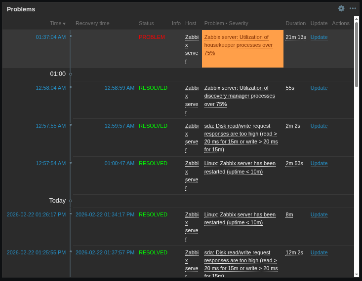
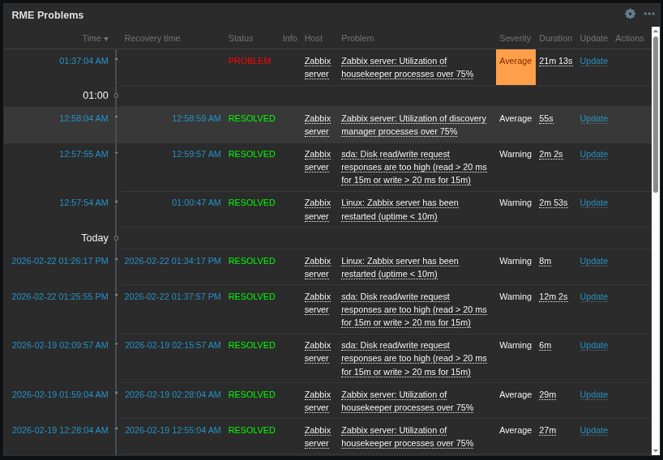

# Zabbix Problems Widget

This widget provides a simple improvement above what the native [Zabbix Problems](https://www.zabbix.com/documentation/current/en/manual/web_interface/frontend_sections/dashboards/widgets/problems) widget provides out of the box.

The native Zabbix Problems widget combines the Problem and Severity into a single column:

**Old way:**
| Problem • Severity |
|--------------------|

**New way:**
| Problem | Severity |
|---------|----------|

This widget splits them into distinct columns. The purpose of this is so that users can see the severity name instead of just the color that is associated with the severity. This gives users with and without visual impairments the ability to more quickly understand how significant the problem is.
